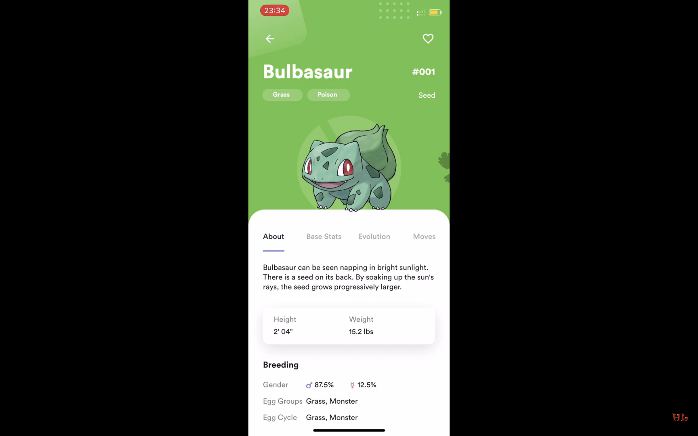

# Flutter Catalogo

Catalogo app built with Flutter

## App preview

")

## Video demo

## Installation

- Add [Flutter](https://flutter.dev/docs/get-started/install) to your machine

- Open this project folder with Terminal/CMD and run `flutter packages get`

- Run `flutter run` to build and run the debug app on your emulator/phone

## Todos

- [x] Home
- [x] Home - Apply Sliver effect in home screen
- [x] Catalogo
- [x] Catalogo - FAB
- [x] Catalogo - Add FAB animation
- [ ] Catalogo - Add grid loading animation
- [x] Catalogo - Add more Ofensors by [balvinderz](https://github.com/balvinderz)
- [x] Catalogo - Add load more
- [x] Ofensor Info
- [x] Ofensor Info - About
- [x] Ofensor Info - Base Stats
- [x] Ofensor Info - Evolution
- [ ] Ofensor Info - Moves (no design)
- [x] Ofensor Info - Make tab area expandable
- [x] Ofensor Info - Add animations
- [x] Ofensor Info - Add more Ofensors by [balvinderz](https://github.com/balvinderz)
- [ ] Ofensor Info - Add missing data in About tab
- [x] Ofensor Info - Add Base Stats data by [balvinderz](https://github.com/balvinderz)
- [x] Ofensor Info - Add Evolution data by [balvinderz](https://github.com/balvinderz)

## Thanks

- [Saepul Nahwan](https://dribbble.com/saepulnahwan23) for his [Catalogo App design](https://dribbble.com/shots/6545819-Catalogo-App)
- [Sabri Bey](https://www.deviantart.com/sabribey) for the Pikachu gif
- [Flutter](https://flutter.dev) for the great cross platform framework

## License

All the code available under the MIT + Apache 2.0. licenses. See [LICENSE](LICENSE).
